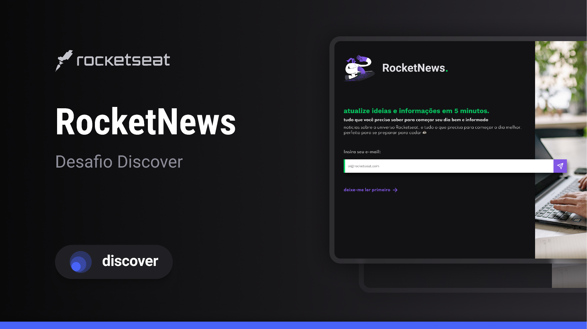

<h1 align='center'>  Rocketseat News </h1>

  <a href="#-tecnologias">Tecnologias</a>&nbsp;&nbsp;&nbsp;|&nbsp;&nbsp;&nbsp;
  <a href="#-projeto">Projeto</a>&nbsp;&nbsp;&nbsp;|&nbsp;&nbsp;&nbsp;
  <a href="#-layout">Layout</a>&nbsp;&nbsp;&nbsp;|&nbsp;&nbsp;&nbsp;
  <a href="#memo-licença">Licença</a>

  

 

  

## 🚀 Tecnologias

Esse projeto foi desenvolvido com as seguintes tecnologias:

- HTML e CSS
- Git e Github
- Figma

## 💻 Projeto
  Este projeto foi feito com intuito de por em prática alguns dos conceitos de css que aprendi durante os últimos meses  

## 🔖 Layout
  Você pode visualizar o layout do projeto através [DESSE LINK](https://www.figma.com/community/file/1241119530230478440). É necessário ter conta no [Figma](https://figma.com) para acessá-lo.
  Você pode visualizar o desafio da rocketseat por meio [DESSE LINK] (https://efficient-sloth-d85.notion.site/b0b109c64d0a4a8eb4de547de18fa04d?v=dd9d2f6b0f6542d69807f41312f4116d&p=2e2c5d56b41f4b13a7d8df6b5affc0ec&pm=c)

## :memo: Licença

Esse projeto está sob a licença MIT.